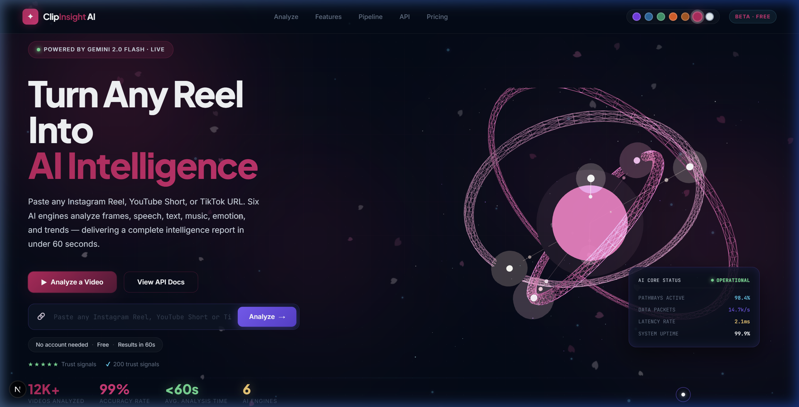
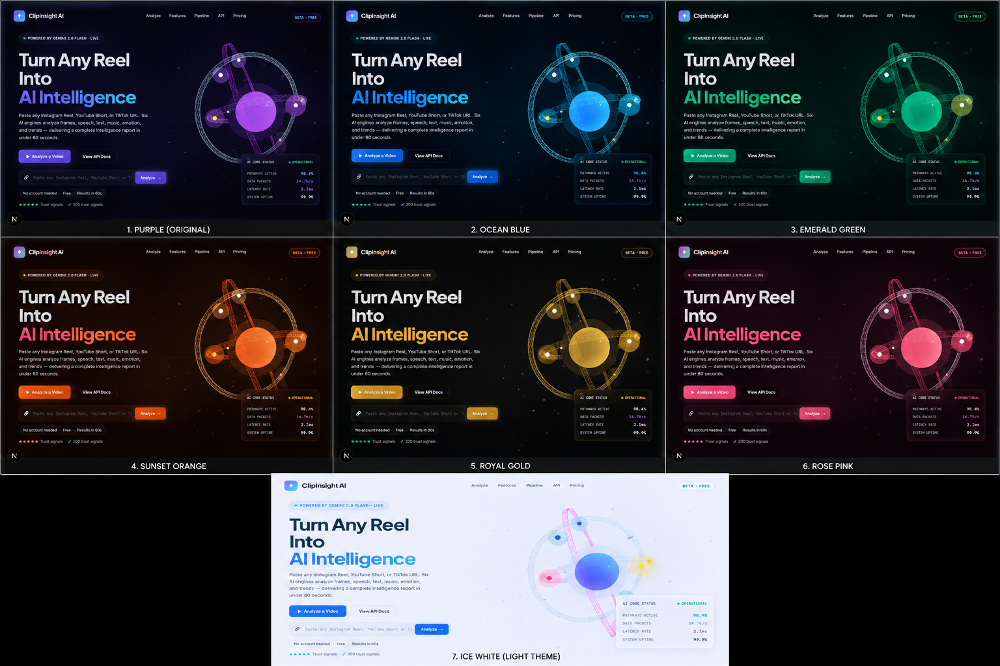
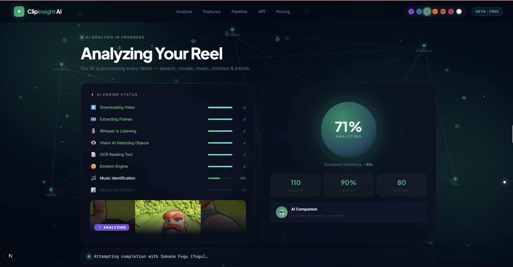
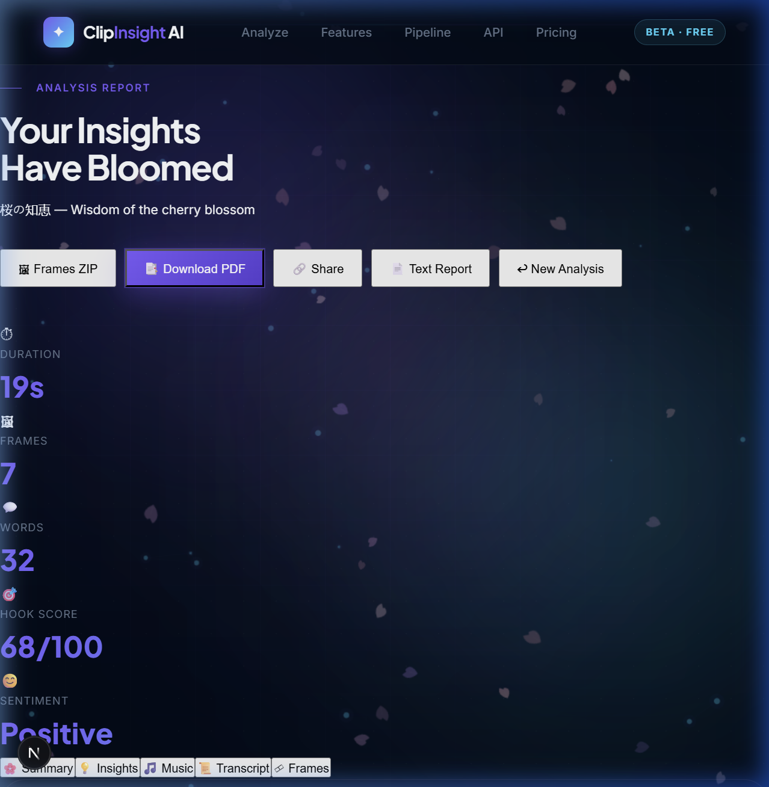
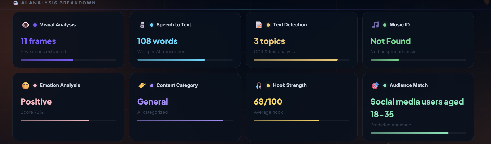
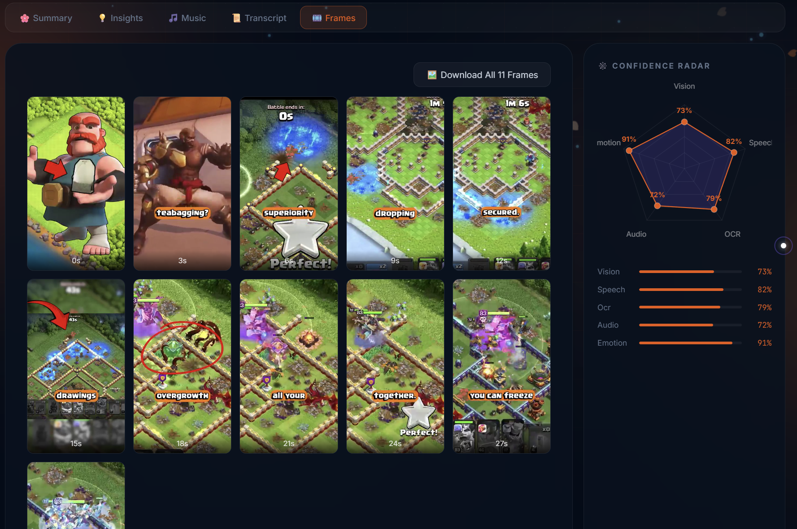
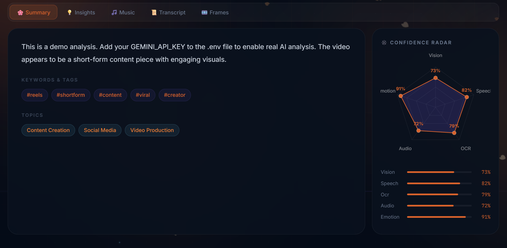
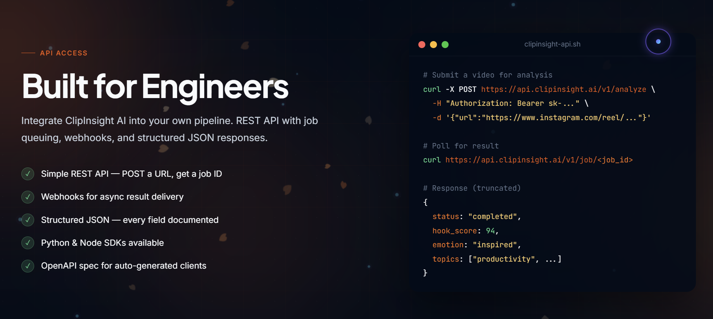

<div align="center">

# 🌸 ClipInsight AI
### *桜の知恵 — Wisdom of the Cherry Blossom*

**Multimodal AI video analyzer for Instagram Reels & YouTube Shorts**

[](https://python.org)
[](https://fastapi.tiangolo.com)
[](https://nextjs.org)
[](https://ai.google.dev)
[](LICENSE)



</div>

---

## 🎯 What it does

Paste any **YouTube Short** or **Instagram Reel** URL → ClipInsight AI runs a full multimodal analysis pipeline and returns:

| Feature | Technology | Details |
|---|---|---|
| 🖼 **Frame extraction** | OpenCV | 40 key frames sampled uniformly |
| 🎙 **Audio transcription** | OpenAI Whisper | Local, no API cost, multilingual |
| 🧠 **AI content analysis** | Google Gemini | Hook score, sentiment, tags, suggestions |
| 🎵 **Music identification** | Shazam FFT | Song, artist, album, cover art |
| 📊 **Hook Score** | Custom scoring | 0–100 rating of first 3 seconds |
| 📦 **Export** | JSZip + PDF | Download frames ZIP + full PDF report |

---

## 🏗️ Architecture

```
┌─────────────────────────────────────────────────────────┐
│                    Next.js Frontend                      │
│   Three.js Sakura BG  │  Progress Tracker  │  Dashboard │
└──────────────────────────────┬──────────────────────────┘
                               │ HTTP / SSE
┌──────────────────────────────▼──────────────────────────┐
│                    FastAPI Backend                       │
│                                                          │
│  URL/Upload → yt-dlp Download                           │
│       ↓                                                  │
│  OpenCV Frame Extraction (40 frames)                    │
│       ↓                                                  │
│  Whisper Transcription (local CPU)                      │
│       ↓                                                  │
│  Gemini Multimodal Analysis (frames + transcript)       │
│       ↓                                                  │
│  Shazam Music Detection (FFT fingerprinting)            │
│       ↓                                                  │
│  Structured JSON Result (Pydantic validated)            │
└─────────────────────────────────────────────────────────┘
```

---

## 🚀 Quick Start

### Prerequisites
- Python 3.11+ (Python 3.13 requires model cache hotfix for Whisper)
- Node.js 18+
- FFmpeg ([install guide](https://ffmpeg.org/download.html))
- Google Gemini API key ([get one free](https://ai.google.dev))

### 1. Clone & install

```bash
git clone https://github.com/Siddhanth2509/ClipInsight-AI.git
cd clipinsight-ai

# Backend
pip install -r backend/requirements.txt

# Frontend
cd frontend && npm install
```

### 2. Configure API key & Session Cookies

#### A. Configure API keys (Windows Users)
You can set your API keys globally in the Windows User Registry so you don't need a `.env` file.
1. Open the [GlobalAPIKeys.ps1](file:///d:/Mine/Learning/Insta%20Reel%20AI/GlobalAPIKeys.ps1) script.
2. Replace the placeholder values with your real keys.
3. Run the script in PowerShell:
   ```powershell
   .\GlobalAPIKeys.ps1
   ```
4. Restart your terminal window to apply.

*Alternatively, copy `.env.example` to `.env` and fill in the values.*

#### B. Bypass Instagram login checks (Optional)
To download age-restricted or private Instagram Reels, you must provide session cookies:
1. Log in to Instagram on your desktop browser.
2. Install a cookie exporter extension (like *Get cookies.txt LOCALLY*).
3. Export your cookies as a Netscape formatted text file.
4. Rename it to `cookies.txt` and save it directly in the project root folder.
*The backend automatically detects it and uses it safely (configured to be excluded from Git commits).*

### 3. Run

```bash
# Terminal 1 — Backend (from project root)
python -m uvicorn backend.main:app --reload --port 8000

# Terminal 2 — Frontend
cd frontend
npm run dev
```

Open **http://localhost:3000** 🌸

---

## 💡 How the AI Pipeline Works

### Token Cost Per Analysis
| Component | Tokens | Cost |
|---|---|---|
| 15 frames × 258 tokens | 3,870 | ~$0.00008 |
| Text prompt | ~450 | ~$0.000009 |
| JSON response | ~420 | ~$0.000008 |
| **Total** | **~4,740** | **≈ $0.0001** |

Whisper (transcription) + Shazam (music) = **$0.00** — fully local.

### Music Detection (No API Key Required)
We implement Shazam's fingerprinting algorithm from scratch in pure Python:
1. Extract 15s of mono 16kHz PCM audio via FFmpeg
2. Apply Hann window + FFT to get frequency spectrum
3. Find constellation peaks across 6 frequency bands
4. Package as binary signature → POST to Shazam discovery API
5. Returns: song, artist, album, genre, cover art, Apple Music link

---

## 🖼 Screenshots

| Homepage (Dark Theme) | Themes Selection (7 Colors) |
|---|---|
|  |  |

| Analysis In Progress | Results Dashboard |
|---|---|
|  |  |

| AI Analysis Breakdown | Extracted Frames |
|---|---|
|  |  |

| Confidence Radar | API Access |
|---|---|
|  |  |

---

## 🧰 Tech Stack

**Backend**
- `FastAPI` — async Python web framework
- `yt-dlp` — video downloading from 1000+ sites
- `OpenCV` — computer vision frame extraction
- `openai-whisper` — local speech-to-text (tiny model)
- `google-genai` — Gemini multimodal AI SDK
- `Pydantic` — structured output validation
- `uvicorn` — ASGI server

**Frontend**
- `Next.js 15` — React framework with App Router
- `Three.js` — 3D sakura particle system (8,000 petals)
- `GSAP` — smooth scroll animations
- `JSZip` — client-side ZIP generation

---

## 🗺️ Roadmap

- [x] Phase 1 — Core pipeline (frames + transcription + Gemini)
- [x] Phase 2 — Music detection + download system
- [x] Phase 3 — PDF export + share links + thumbnail preview
- [x] Phase 4 — Batch comparison + history panel
- [ ] Phase 5 — User accounts + persistent history
- [ ] Phase 6 — TikTok deep integration + browser extension
- [ ] Phase 7 — Monetization (credits + API)

---

## 📄 License

MIT License — see [LICENSE](LICENSE) for details.

---

<div align="center">
  <sub>Built with 🌸 and a lot of cherry blossoms</sub>
</div>
